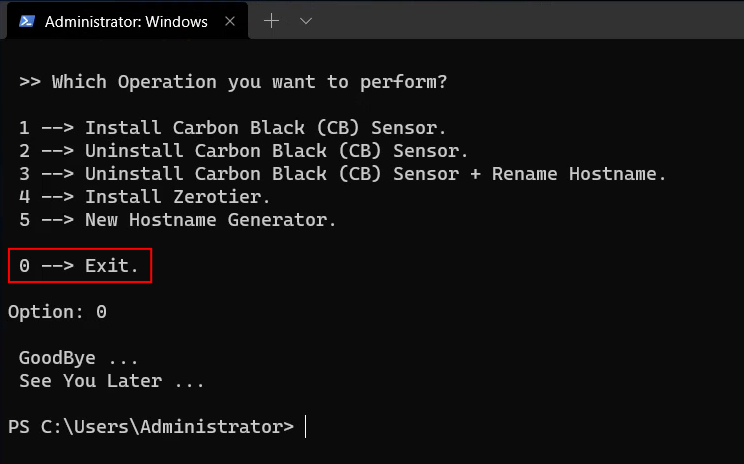

# TBX
Tool Box for auto customization for windows testing

##Run powershell as an admin and type this command to ensure the following commands will actually work!!
```powershell
Set-ExecutionPolicy RemoteSigned
```

## Run and Go (Double-Click) ...
```powershell
curl https://raw.githubusercontent.com/VTFoundation/tbx/main/tbx.bat -o tbx.bat

# Using CMD?
curl https://raw.githubusercontent.com/VTFoundation/tbx/main/tbx.bat -o tbx.bat && .\tbx.bat

# Or PowerShell ...
curl https://raw.githubusercontent.com/VTFoundation/tbx/main/tbx.bat -o tbx.bat; .\tbx.bat
```

## When you simply Exit !!

